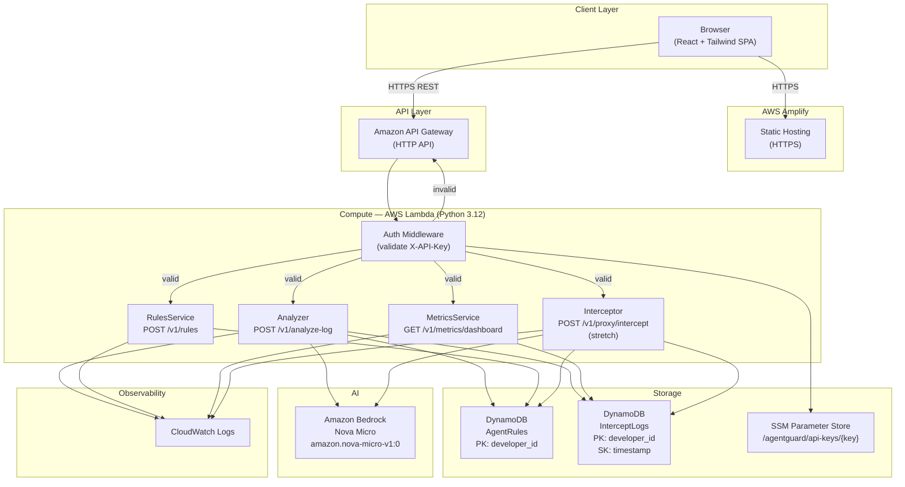

# Design Document — AgentGuard.ai

## Overview

AgentGuard.ai is a serverless cost-guardrail service for AI agent developers. It accepts a tool-call payload, estimates its token cost using a character-count heuristic, classifies the risk, and — when cost exceeds the developer's budget threshold — calls Amazon Bedrock (Nova Micro) to generate a cheaper CLI or script alternative. Every analysis is logged (without raw payload retention) and a React dashboard surfaces cumulative savings in real time.

**MVP scope:** `POST /v1/analyze-log` + frontend Analyze tab + live savings counter. All other endpoints are secondary deliverables within the same SAM deployment.

### Key Design Decisions

| Decision | Choice | Rationale |
|---|---|---|
| Compute | AWS Lambda (Python 3.12) | Free-tier eligible, zero cold-start cost at MVP scale |
| Database | DynamoDB on-demand | No capacity planning; TTL available for future log pruning |
| AI model | amazon.nova-micro-v1:0 | Cheapest Bedrock model; $0.000035/1K input tokens |
| Auth | SSM Parameter Store key lookup | Simple, secure, no Cognito overhead |
| Frontend hosting | AWS Amplify | HTTPS out of the box, CI/CD hooks for future updates |
| IaC | AWS SAM (template.yaml) | Single `sam deploy`; native Lambda/APIGW support |
| Region | us-east-1 | All required services available; lowest latency to Bedrock |

---

## Architecture

### Component Diagram



### Request Flow — POST /v1/analyze-log

```
Client
  │  POST /v1/analyze-log  {X-API-Key, developer_id, payload}
  ▼
API Gateway (HTTP API)
  │
  ▼
Lambda: Analyzer
  ├─ 1. Validate X-API-Key via SSM Parameter Store
  │      └─ 401 if missing/invalid
  ├─ 2. Validate request body (payload non-empty)
  │      └─ 400 if invalid
  ├─ 3. Token_Estimator: tokens = floor(len(payload) / 4)
  ├─ 4. Cost calculation: cost_usd = tokens * 0.000035 / 1000
  ├─ 5. Risk_Classifier: low/medium/high based on tokens
  ├─ 6. Fetch Budget_Threshold from AgentRules (default 0.01)
  ├─ 7. IF cost_usd > budget_threshold:
  │      └─ Alternative_Generator: invoke Bedrock (10s timeout)
  │           ├─ Success → parse JSON alternative
  │           └─ Timeout/Error → fallback (risk_level=unknown, alt=null)
  ├─ 8. Write InterceptLog record (no raw payload)
  │      └─ DynamoDB error → log to CW, continue
  └─ 9. Return 200 with analysis result
```

---

## Components and Interfaces

### Backend Components

#### Token_Estimator (`core/token_estimator.py`)
- **Interface:** `estimate(payload: str) -> int`
- **Input:** Any string (tool-call payload or log text)
- **Output:** Non-negative integer token count
- **Dependency:** None (pure function)

#### Risk_Classifier (`core/risk_classifier.py`)
- **Interface:** `classify(tokens: int) -> str`
- **Input:** Non-negative integer
- **Output:** One of `"low"`, `"medium"`, `"high"`
- **Dependency:** None (pure function)

#### Alternative_Generator (`core/alternative_gen.py`)
- **Interface:** `generate(payload: str, tokens_estimated: int) -> tuple[dict | None, int, str | None]`
- **Returns:** `(alternative_dict_or_none, tokens_saved, fallback_reason_or_none)`
- **Dependencies:** Amazon Bedrock Runtime (`bedrock-runtime`), `botocore`

#### Auth (`core/auth.py`)
- **Interface:** `validate_key(api_key: str) -> str | None`
- **Returns:** `developer_id` string if valid, `None` if invalid
- **Dependencies:** AWS SSM Parameter Store (`ssm`)

#### DynamoDB Helpers (`core/dynamo.py`)
- **Interfaces:**
  - `get_rule(developer_id: str) -> dict` → Returns `{budget_threshold_usd, action}` or defaults
  - `upsert_rule(developer_id: str, budget_threshold_usd: float, action: str) -> None`
  - `put_log(developer_id: str, tokens_estimated: int, cost_usd: float, risk_level: str, tokens_saved: int) -> None`
  - `query_logs(developer_id: str, limit: int) -> list[dict]`
- **Dependencies:** AWS DynamoDB (`dynamodb`)

### Frontend Components

#### `<SavingsCounter />`
- **Props:** `totalTokensSaved: number`, `totalCostSaved: number`
- **Events emitted:** None (display-only)

#### `<AnalyzeTab />`
- **Props:** `developerId: string`, `onSavingsUpdate: (tokensSaved: number) => void`
- **State:** `payloadText`, `isLoading`, `result`, `error`
- **API calls:** `POST /v1/analyze-log`

#### `<RiskBadge />`
- **Props:** `riskLevel: "low" | "medium" | "high" | "unknown"`
- **Output:** Color-coded badge element

#### `<RulesTab />`
- **Props:** `developerId: string`
- **State:** `budgetThreshold`, `action`, `isSaving`, `saveStatus`
- **API calls:** `POST /v1/rules`

#### `<MetricsTab />`
- **Props:** `developerId: string`
- **State:** `metricsData`, `isLoading`
- **API calls:** `GET /v1/metrics/dashboard`

#### `api/client.ts`
- **Exports:** `analyzePayload()`, `saveRules()`, `fetchMetrics()`
- **Configuration:** `VITE_API_BASE_URL`, `VITE_API_KEY` env vars

---

## API Design

All endpoints are served under the API Gateway base URL. Every request must include `X-API-Key` header. All responses are `application/json`.

### POST /v1/analyze-log

**Purpose:** Estimate token cost, classify risk, optionally generate alternative.

**Request Body**

```json
{
  "developer_id": "string (required)",
  "payload": "string (required, non-empty)"
}
```

**Response 200**

```json
{
  "developer_id": "string",
  "tokens_estimated": 1234,
  "cost_usd": 0.00004319,
  "risk_level": "low | medium | high | unknown",
  "suggested_alternative": {
    "alternative_type": "cli_command",
    "alternative_command": "aws s3 ls s3://my-bucket",
    "estimated_token_savings_pct": 94,
    "explanation": "Direct CLI replaces 50k-token agent traversal"
  },
  "tokens_saved": 1160,
  "message": "string (only present on fallback)"
}
```

`suggested_alternative` is `null` and `tokens_saved` is `0` when cost does not exceed threshold.

**Response 400** — missing/empty payload or `developer_id`

```json
{"error": "payload field is required and must be non-empty"}
```

**Response 401** — missing or invalid API key

```json
{"error": "Unauthorized: invalid or missing X-API-Key"}
```

---

### POST /v1/rules

**Purpose:** Upsert per-developer budget threshold and action preference.

**Request Body**

```json
{
  "developer_id": "string (required)",
  "budget_threshold_usd": 0.01,
  "action": "reroute | block"
}
```

**Response 200**

```json
{
  "developer_id": "string",
  "budget_threshold_usd": 0.01,
  "action": "reroute",
  "updated_at": "2024-01-15T10:30:00Z"
}
```

**Response 400** — invalid field values

```json
{"error": "budget_threshold_usd must be a positive number"}
```

---

### GET /v1/metrics/dashboard

**Purpose:** Return cumulative savings and recent call history.

**Query Parameters:** `developer_id` (required)

**Response 200**

```json
{
  "developer_id": "string",
  "total_calls_analyzed": 42,
  "total_tokens_saved": 1840000,
  "total_cost_saved_usd": 64.40,
  "recent_calls": [
    {
      "timestamp": "2024-01-15T10:30:00Z",
      "tokens_estimated": 32000,
      "cost_usd": 1.12,
      "risk_level": "high",
      "tokens_saved": 30800
    }
  ]
}
```

`recent_calls` contains up to 20 records, ordered by timestamp descending.

---

### POST /v1/proxy/intercept (Stretch)

**Purpose:** Inline proxy — analyze and optionally block before agent execution.

**Request Body** — same as `/v1/analyze-log`

**Response 200**

```json
{
  "status": "allowed | blocked | rerouted",
  "risk_level": "low | medium | high | unknown",
  "suggested_alternative": { ... } | null,
  "tokens_estimated": 1234,
  "cost_usd": 0.00004319
}
```

---

## Data Models

### DynamoDB — AgentRules Table

**Table:** `AgentRules`  
**Billing mode:** PAY_PER_REQUEST (on-demand)  
**Primary key:** PK = `developer_id` (String)

| Attribute | Type | Description |
|---|---|---|
| `developer_id` | S (PK) | Unique developer identifier |
| `budget_threshold_usd` | N | Max acceptable cost per call in USD |
| `action` | S | `"reroute"` or `"block"` |
| `updated_at` | S | ISO 8601 UTC timestamp of last upsert |

Default values (applied in code when no record exists):
- `budget_threshold_usd`: `0.01`
- `action`: `"reroute"`

---

### DynamoDB — InterceptLogs Table

**Table:** `InterceptLogs`  
**Billing mode:** PAY_PER_REQUEST  
**Primary key:** PK = `developer_id` (String), SK = `timestamp` (String, ISO 8601 UTC)

| Attribute | Type | Description |
|---|---|---|
| `developer_id` | S (PK) | Developer identifier |
| `timestamp` | S (SK) | ISO 8601 UTC (microsecond precision for uniqueness) |
| `tokens_estimated` | N | Estimated token count |
| `cost_usd` | N | Estimated cost in USD (stored as Decimal) |
| `risk_level` | S | `low`, `medium`, `high`, or `unknown` |
| `tokens_saved` | N | Tokens saved if alternative was generated, else 0 |

> **Zero Payload Retention:** The raw `payload` field is **never** written to this table, CloudWatch, or any other store.

**Access patterns:**
- Write: `PutItem` with `developer_id` + `timestamp` (after each analysis)
- Read (metrics): `Query` on PK = `developer_id` with `ScanIndexForward=False`, `Limit=20`
- Aggregate: scan all PK items to sum `tokens_estimated`, `cost_usd`, `tokens_saved` (acceptable at MVP scale; consider DynamoDB Streams + counter table for scale)

---

### SSM Parameter Store — API Keys

**Path pattern:** `/agentguard/api-keys/{hashed_key}` → value: `developer_id`

The key stored in the path segment is the SHA-256 hex digest of the raw API key, so the raw key is never stored in SSM. The auth middleware hashes the incoming `X-API-Key` header and performs a `GetParameter` lookup.

**Demo key (pre-seeded):**
- `developer_id`: `"demo"`
- SSM path: `/agentguard/api-keys/{sha256(DEMO_KEY_VALUE)}`

---

## Lambda Function Breakdown

Each Lambda function is a separate handler in the `src/` directory, all sharing common utility modules.

```
src/
├── handlers/
│   ├── analyze.py          # POST /v1/analyze-log
│   ├── rules.py            # POST /v1/rules
│   ├── metrics.py          # GET /v1/metrics/dashboard
│   └── intercept.py        # POST /v1/proxy/intercept (stretch)
├── core/
│   ├── auth.py             # X-API-Key validation via SSM
│   ├── token_estimator.py  # character_count / 4 heuristic
│   ├── risk_classifier.py  # low/medium/high thresholds
│   ├── alternative_gen.py  # Bedrock Nova Micro integration
│   └── dynamo.py           # DynamoDB put/query helpers
└── requirements.txt
```

### handlers/analyze.py

Entry point: `lambda_handler(event, context)`

```
1. Extract X-API-Key → auth.validate_key() → 401 if fail
2. Parse body → validate developer_id + payload → 400 if fail
3. token_estimator.estimate(payload) → tokens_estimated
4. cost = tokens_estimated * PRICE_PER_1K_TOKENS / 1000
5. risk_classifier.classify(tokens_estimated) → risk_level
6. dynamo.get_rule(developer_id) → budget_threshold (default 0.01)
7. if cost > budget_threshold:
       alternative_gen.generate(payload, tokens_estimated) → alternative, tokens_saved
   else:
       alternative = None; tokens_saved = 0
8. dynamo.put_log(developer_id, tokens_estimated, cost, risk_level, tokens_saved)
   (fire-and-forget; errors logged to CW, not re-raised)
9. return 200 response
```

### handlers/rules.py

```
1. auth.validate_key() → 401 if fail
2. Parse + validate body (budget_threshold_usd > 0, action in {reroute, block}) → 400 if fail
3. dynamo.upsert_rule(developer_id, budget_threshold_usd, action)
4. return 200 with saved rule
```

### handlers/metrics.py

```
1. auth.validate_key() → 401 if fail
2. Extract developer_id from query params → 400 if missing
3. dynamo.query_logs(developer_id, limit=20) → records
4. Aggregate totals from full query (sum tokens_saved, cost_usd; count records)
5. return 200 with aggregates + recent_calls
```

### handlers/intercept.py (Stretch)

Same flow as analyze.py, plus:
```
6. Lookup Developer action from AgentRules
7. if risk_level == "high" and action == "block" → status="blocked"
   if risk_level == "high" and action == "reroute" → status="rerouted"
   else → status="allowed"
8. Return status + result
```

### core/auth.py

```python
import hashlib, boto3, os

SSM = boto3.client("ssm", region_name="us-east-1")
_cache: dict[str, str] = {}   # in-memory per Lambda instance

def validate_key(api_key: str) -> str | None:
    """Returns developer_id or None if invalid."""
    key_hash = hashlib.sha256(api_key.encode()).hexdigest()
    if key_hash in _cache:
        return _cache[key_hash]
    path = f"/agentguard/api-keys/{key_hash}"
    try:
        resp = SSM.get_parameter(Name=path, WithDecryption=True)
        developer_id = resp["Parameter"]["Value"]
        _cache[key_hash] = developer_id
        return developer_id
    except SSM.exceptions.ParameterNotFound:
        return None
```

---

## Token Estimation and Cost Calculation Logic

### Token Estimator

```python
# core/token_estimator.py
# NOTE: This is a placeholder heuristic. Replace with tiktoken or a
# model-specific tokenizer (e.g., amazon.nova tokenizer) before production.

def estimate(payload: str) -> int:
    """Estimate token count as floor(character_count / 4)."""
    return len(payload) // 4
```

The `// 4` heuristic works because English text averages ~4 characters per token in most transformer tokenizers. It intentionally over-estimates for non-English or structured data (JSON/XML), acting as a conservative safety margin.

### Cost Calculation

```python
# core/token_estimator.py (continued)

# Nova Micro pricing (us-east-1, as of hackathon build)
# Input:  $0.000035 per 1,000 input tokens
# NOTE: Update this constant if pricing changes.
PRICE_PER_1K_INPUT_TOKENS = 0.000035

def estimate_cost(tokens: int) -> float:
    """Return estimated cost in USD for the given token count."""
    return tokens * PRICE_PER_1K_INPUT_TOKENS / 1000
```

**tokens_saved calculation:**

When an alternative is generated, `tokens_saved` is calculated as:

```python
tokens_saved = tokens_estimated - alternative.get("estimated_token_savings_pct", 0) / 100 * tokens_estimated
# Simplified: tokens_saved = int(tokens_estimated * savings_pct / 100)
```

If no alternative is generated, `tokens_saved = 0`.

---

## Risk Classification Logic

```python
# core/risk_classifier.py

LOW_THRESHOLD = 1000    # tokens < 1000  → low
HIGH_THRESHOLD = 10000  # tokens >= 10000 → high
                        # 1000 <= tokens < 10000 → medium

def classify(tokens: int) -> str:
    """Classify token count into risk level."""
    if tokens < LOW_THRESHOLD:
        return "low"
    elif tokens < HIGH_THRESHOLD:
        return "medium"
    else:
        return "high"
```

Boundary conditions (per requirements):

| Tokens | Risk Level |
|--------|------------|
| 0–999 | `low` |
| 1,000–9,999 | `medium` |
| ≥ 10,000 | `high` |
| Bedrock error | `unknown` |

---

## Bedrock Integration Design

### Module: core/alternative_gen.py

```python
import boto3, json, logging
from botocore.config import Config

BEDROCK_TIMEOUT_SECONDS = 10
MODEL_ID = "amazon.nova-micro-v1:0"

bedrock = boto3.client(
    "bedrock-runtime",
    region_name="us-east-1",
    config=Config(
        connect_timeout=BEDROCK_TIMEOUT_SECONDS,
        read_timeout=BEDROCK_TIMEOUT_SECONDS,
    ),
)

PROMPT_TEMPLATE = """You are a cost-optimization assistant for AI agent developers.
A tool-call payload has been submitted with an estimated token cost of {tokens_estimated} tokens.
This exceeds the developer's budget threshold.

Analyze the payload and respond with ONLY a JSON object — no markdown, no explanation outside the JSON.
The JSON must exactly match this schema:
{{
  "alternative_type": "<cli_command|python_script|bash_script|api_call>",
  "alternative_command": "<the cheaper command or script>",
  "estimated_token_savings_pct": <integer 0-100>,
  "explanation": "<one sentence explaining the savings>"
}}

Payload:
{payload}"""
```

### Invocation Flow

```
alternative_gen.generate(payload, tokens_estimated)
  │
  ├─ Build prompt from PROMPT_TEMPLATE
  ├─ Call bedrock.invoke_model(modelId=MODEL_ID, body=..., timeout=10s)
  │
  ├─ SUCCESS path:
  │   ├─ Parse response body JSON
  │   ├─ Extract generated text from response["output"]["message"]["content"][0]["text"]
  │   ├─ Parse text as JSON → validate keys present
  │   └─ Return (alternative_dict, tokens_saved)
  │
  └─ FAILURE paths:
      ├─ ReadTimeout / ConnectTimeout:
      │   └─ log warning to CW; return (None, 0, "fallback_timeout")
      ├─ ClientError (Bedrock service error):
      │   └─ log error to CW; return (None, 0, "fallback_service_error")
      └─ JSONDecodeError (bad model output):
          └─ log raw response to CW; return (None, 0, "fallback_parse_error")
```

### Prompt Design

- **Strict JSON output:** The prompt instructs the model to return only a JSON object with no surrounding markdown or text. This is the most reliable way to get parseable output from Nova Micro.
- **Schema injection:** The exact expected schema is embedded in the prompt so the model cannot hallucinate field names.
- **No system prompt separate from user prompt:** The Nova Micro API uses a messages array; the entire instruction + payload is sent as a single `user` message to minimize API complexity.

### Timeout Handling

The `botocore.config.Config` `read_timeout` parameter causes the boto3 call to raise `botocore.exceptions.ReadTimeoutError` after 10 seconds. This is caught in the failure path above. The Lambda itself has a 30-second timeout, giving 20 seconds of headroom for the rest of the request lifecycle.

### Fallback Behavior

When any Bedrock failure occurs:
- `risk_level` is overridden to `"unknown"`
- `suggested_alternative` is set to `null`
- `tokens_saved` is set to `0`
- Response HTTP status remains `200`
- A `message` field is added: `"Alternative generation temporarily unavailable. Analysis results are still valid."`

---

## API Key Auth Flow

```
Incoming request
  │
  ▼
Extract X-API-Key header
  │
  ├─ Missing → return 401 {"error": "Unauthorized: X-API-Key header is required"}
  │
  ▼
Hash key: sha256(api_key).hexdigest()
  │
  ▼
Check in-memory cache (per Lambda instance)
  │
  ├─ Cache hit → return developer_id
  │
  ▼
SSM GetParameter: /agentguard/api-keys/{hash}
  │
  ├─ ParameterNotFound → return 401 {"error": "Unauthorized: invalid API key"}
  ├─ SSM error → return 401 (fail closed)
  │
  ▼
Cache developer_id in memory
Return developer_id to handler
```

**Security properties:**
- Raw API keys are never stored anywhere (only SHA-256 hashes are used as SSM path segments)
- The SSM parameter value stores only `developer_id` (not the key itself)
- In-memory cache means one SSM call per Lambda cold start per unique key (not per request)
- Cache is intentionally not invalidated — key rotation requires Lambda function update or cold start cycle (acceptable for MVP)
- Lambda execution role has `ssm:GetParameter` scoped to `/agentguard/api-keys/*` only

---

## Frontend Component Structure

The frontend is a React 18 + Tailwind CSS SPA built with Vite. It is deployed as a static site on AWS Amplify.

### Component Hierarchy

```
App
├── Header
│   ├── Logo ("AgentGuard.ai")
│   ├── SavingsCounter
│   │   ├── TokensSavedDisplay  (live counter)
│   │   └── DollarsSavedDisplay (live counter)
│   └── TabNav ["Analyze", "Rules", "Metrics"]
│
├── AnalyzeTab  (MVP)
│   ├── PayloadTextarea
│   ├── AnalyzeButton (disabled + spinner during in-flight)
│   └── ResultCard
│       ├── RiskBadge   (green/yellow/red/grey)
│       ├── TokenCostRow (tokens_estimated, cost_usd)
│       ├── AlternativeBlock (code block + explanation, conditional)
│       └── ErrorBanner (conditional)
│
├── RulesTab
│   ├── BudgetThresholdInput (numeric, USD)
│   ├── ActionToggle ("reroute" | "block")
│   ├── SaveButton
│   └── SuccessBanner / ErrorBanner
│
└── MetricsTab
    ├── MetricsChart (bar/line, tokens_saved per call)
    └── CallsTable
        └── CallRow (timestamp, tokens, cost, risk_level, tokens_saved)
```

### State Management

Simple `useState` + `useEffect` hooks (no Redux/Zustand at MVP scale).

```
AppState:
  - developer_id: string        (hardcoded "demo" for MVP, input field later)
  - totalTokensSaved: number
  - totalCostSaved: number
  - recentCalls: Call[]

AnalyzeState:
  - payloadText: string
  - isLoading: boolean
  - result: AnalysisResult | null
  - error: string | null

RulesState:
  - budgetThreshold: number
  - action: "reroute" | "block"
  - isSaving: boolean
  - saveStatus: "idle" | "success" | "error"
```

### Live Savings Counter Update Flow

```
1. App mounts → fetch GET /v1/metrics/dashboard → set totalTokensSaved, totalCostSaved
2. User clicks Analyze → POST /v1/analyze-log
3. On success response:
   a. Display result in ResultCard
   b. If tokens_saved > 0:
       totalTokensSaved += response.tokens_saved
       totalCostSaved += response.tokens_saved * PRICE_PER_1K_TOKENS / 1000
```

### API Client Module (src/api/client.ts)

```typescript
const API_BASE = import.meta.env.VITE_API_BASE_URL;
const API_KEY  = import.meta.env.VITE_API_KEY;

const headers = {
  "Content-Type": "application/json",
  "X-API-Key": API_KEY,
};

export const analyzePayload = (developerId: string, payload: string) =>
  fetch(`${API_BASE}/v1/analyze-log`, {
    method: "POST",
    headers,
    body: JSON.stringify({ developer_id: developerId, payload }),
  }).then(r => r.json());
```

Environment variables are injected at Amplify build time via the Amplify environment variables console.

### Styling Conventions

- Background: `bg-gray-950` (near-black)
- Accent: `text-blue-500` / `border-blue-500` (#3B82F6)
- Risk badges:
  - `low` → `bg-green-500/20 text-green-400`
  - `medium` → `bg-yellow-500/20 text-yellow-400`
  - `high` → `bg-red-500/20 text-red-400`
  - `unknown` → `bg-gray-500/20 text-gray-400`
- Alternative code block: `bg-gray-800 font-mono text-sm p-4 rounded-lg`

---

## SAM Template Structure

### template.yaml Overview

```yaml
AWSTemplateFormatVersion: '2010-09-09'
Transform: AWS::Serverless-2016-10-31
Description: AgentGuard.ai — AI agent cost guardrail service

Globals:
  Function:
    Runtime: python3.12
    Timeout: 30
    MemorySize: 256
    Environment:
      Variables:
        AGENT_RULES_TABLE: !Ref AgentRulesTable
        INTERCEPT_LOGS_TABLE: !Ref InterceptLogsTable
        BEDROCK_MODEL_ID: amazon.nova-micro-v1:0
        AWS_DEFAULT_REGION: us-east-1

Resources:

  # ── API Gateway ────────────────────────────────────────────────
  AgentGuardApi:
    Type: AWS::Serverless::HttpApi
    Properties:
      CorsConfiguration:
        AllowOrigins: ["*"]
        AllowHeaders: ["Content-Type", "X-API-Key"]
        AllowMethods: ["GET", "POST", "OPTIONS"]

  # ── Lambda Functions ───────────────────────────────────────────
  AnalyzerFunction:
    Type: AWS::Serverless::Function
    Properties:
      CodeUri: src/
      Handler: handlers.analyze.lambda_handler
      Policies:
        - DynamoDBCrudPolicy: {TableName: !Ref AgentRulesTable}
        - DynamoDBCrudPolicy: {TableName: !Ref InterceptLogsTable}
        - SSMParameterReadPolicy: {ParameterName: "/agentguard/api-keys/*"}
        - Statement:
            Effect: Allow
            Action: [bedrock:InvokeModel]
            Resource: "arn:aws:bedrock:us-east-1::foundation-model/amazon.nova-micro-v1:0"
      Events:
        AnalyzeLog:
          Type: HttpApi
          Properties:
            ApiId: !Ref AgentGuardApi
            Path: /v1/analyze-log
            Method: POST

  RulesFunction:
    Type: AWS::Serverless::Function
    Properties:
      CodeUri: src/
      Handler: handlers.rules.lambda_handler
      Policies:
        - DynamoDBCrudPolicy: {TableName: !Ref AgentRulesTable}
        - SSMParameterReadPolicy: {ParameterName: "/agentguard/api-keys/*"}
      Events:
        Rules:
          Type: HttpApi
          Properties:
            ApiId: !Ref AgentGuardApi
            Path: /v1/rules
            Method: POST

  MetricsFunction:
    Type: AWS::Serverless::Function
    Properties:
      CodeUri: src/
      Handler: handlers.metrics.lambda_handler
      Policies:
        - DynamoDBReadPolicy: {TableName: !Ref InterceptLogsTable}
        - SSMParameterReadPolicy: {ParameterName: "/agentguard/api-keys/*"}
      Events:
        MetricsDashboard:
          Type: HttpApi
          Properties:
            ApiId: !Ref AgentGuardApi
            Path: /v1/metrics/dashboard
            Method: GET

  # ── DynamoDB Tables ────────────────────────────────────────────
  AgentRulesTable:
    Type: AWS::DynamoDB::Table
    Properties:
      TableName: AgentRules
      BillingMode: PAY_PER_REQUEST
      AttributeDefinitions:
        - {AttributeName: developer_id, AttributeType: S}
      KeySchema:
        - {AttributeName: developer_id, KeyType: HASH}

  InterceptLogsTable:
    Type: AWS::DynamoDB::Table
    Properties:
      TableName: InterceptLogs
      BillingMode: PAY_PER_REQUEST
      AttributeDefinitions:
        - {AttributeName: developer_id, AttributeType: S}
        - {AttributeName: timestamp, AttributeType: S}
      KeySchema:
        - {AttributeName: developer_id, KeyType: HASH}
        - {AttributeName: timestamp, KeyType: RANGE}

Outputs:
  ApiBaseUrl:
    Description: API Gateway base URL
    Value: !Sub "https://${AgentGuardApi}.execute-api.us-east-1.amazonaws.com"
  AnalyzerFunctionArn:
    Value: !GetAtt AnalyzerFunction.Arn
```

### Deployment Steps

```bash
# 1. Build
sam build

# 2. Deploy (first time — creates CloudFormation stack)
sam deploy \
  --stack-name agent-guard-ai \
  --region us-east-1 \
  --capabilities CAPABILITY_IAM \
  --resolve-s3

# 3. Seed demo API key in SSM (run once after deploy)
python scripts/seed_demo_key.py

# 4. Note ApiBaseUrl from stack outputs
aws cloudformation describe-stacks \
  --stack-name agent-guard-ai \
  --query "Stacks[0].Outputs"
```

---

## Amplify Deployment Approach

### Build Configuration (amplify.yml)

```yaml
version: 1
frontend:
  phases:
    preBuild:
      commands:
        - npm ci
    build:
      commands:
        - npm run build
  artifacts:
    baseDirectory: dist
    files:
      - '**/*'
  cache:
    paths:
      - node_modules/**/*
```

### Environment Variables (set in Amplify Console)

| Variable | Value | Notes |
|---|---|---|
| `VITE_API_BASE_URL` | `https://{api-id}.execute-api.us-east-1.amazonaws.com` | From SAM stack output |
| `VITE_API_KEY` | `{demo-api-key-value}` | The raw demo key (not the hash) |
| `VITE_DEVELOPER_ID` | `demo` | Hardcoded for MVP |

### Deployment Flow

```
1. Create Amplify app (console or CLI)
2. Connect to GitHub repo (or use manual deploy)
3. Set environment variables in Amplify Console
4. Trigger build → Amplify runs amplify.yml → uploads dist/ to S3
5. Amplify provides HTTPS URL: https://{branch}.{appid}.amplifyapp.com
```

For manual deploy (no Git):
```bash
# Build locally
npm run build

# Deploy to Amplify using CLI
aws amplify create-app --name agent-guard-ai-frontend
aws amplify create-branch --app-id {app-id} --branch-name main
zip -r dist.zip dist/
aws amplify start-deployment --app-id {app-id} --branch-name main \
  --source-url s3://{bucket}/dist.zip
```

**CORS note:** The API Gateway SAM resource already includes `AllowOrigins: ["*"]` for development. For production, restrict to the Amplify domain.

---

## Error Handling

### Error Response Format

All error responses use a consistent JSON envelope:

```json
{"error": "Human-readable description of the problem"}
```

No stack traces, internal exception messages, or raw AWS error codes are ever returned to the client.

### Error Handling Matrix

| Scenario | HTTP Status | Response Body | Action |
|---|---|---|---|
| Missing X-API-Key header | 401 | `{"error": "Unauthorized: X-API-Key header is required"}` | Return immediately |
| Invalid API key | 401 | `{"error": "Unauthorized: invalid API key"}` | Return immediately |
| Missing/empty payload | 400 | `{"error": "payload field is required and must be non-empty"}` | Return immediately |
| Missing developer_id | 400 | `{"error": "developer_id is required"}` | Return immediately |
| Invalid budget_threshold_usd | 400 | `{"error": "budget_threshold_usd must be a positive number"}` | Return immediately |
| Invalid action value | 400 | `{"error": "action must be 'reroute' or 'block'"}` | Return immediately |
| Bedrock timeout | 200 | Include `risk_level: "unknown"`, `message: "..."` | Fallback, log to CW |
| Bedrock service error | 200 | Include `risk_level: "unknown"`, `message: "..."` | Fallback, log to CW |
| Bedrock JSON parse error | 200 | Include `risk_level: "unknown"`, `message: "..."` | Log raw to CW |
| DynamoDB write failure (log) | 200 | Normal analysis response | Log error to CW |
| DynamoDB read failure (metrics) | 200 | `{"message": "Metrics temporarily unavailable"}` | Log error to CW |

**No 5xx responses are ever returned to the client.** All infrastructure errors are absorbed and downgraded to either 200 with a degraded response or a 4xx for client errors.

---

## Correctness Properties

*A property is a characteristic or behavior that should hold true across all valid executions of a system — essentially, a formal statement about what the system should do. Properties serve as the bridge between human-readable specifications and machine-verifiable correctness guarantees.*

**Property Reflection:** Before writing properties, I reviewed all testable prework items and consolidated redundancies:
- Requirements 1.3, 1.4, 1.5 all test the same `classify()` function with different ranges — combined into one comprehensive boundary property.
- Requirements 6.1 and 6.2 are logically identical (both test that invalid/missing keys return 401) — combined.
- Requirements 2.1 and 2.3 together define the complete decision logic for when to invoke Bedrock — both included as they test complementary paths.
- Requirements 3.1 and 3.2 are distinct: one tests that required fields ARE written, the other tests that the payload field is NEVER written — both kept.

---

### Property 1: Token estimator is floor division by four

*For any* string `s`, the token estimator must return exactly `len(s) // 4`. The estimate is a pure function with no side effects.

**Validates: Requirements 1.2**

---

### Property 2: Risk classifier covers all token ranges without gaps

*For any* non-negative integer `n`, `classify(n)` must return exactly one of `"low"`, `"medium"`, or `"high"`, and the returned value must be `"low"` if `n < 1000`, `"medium"` if `1000 <= n < 10000`, and `"high"` if `n >= 10000`. No integer exists that returns a value outside these boundaries or falls into the wrong bucket.

**Validates: Requirements 1.3, 1.4, 1.5**

---

### Property 3: Analysis response always contains all required fields for valid input

*For any* non-empty payload string and valid developer ID, calling the analyze function must return a response containing `tokens_estimated` (non-negative integer), `cost_usd` (non-negative float), `risk_level` (one of low/medium/high/unknown), `suggested_alternative` (object or null), and `tokens_saved` (non-negative integer).

**Validates: Requirements 1.1**

---

### Property 4: Empty and whitespace-only payloads are always rejected with 400

*For any* string composed entirely of whitespace characters (space, tab, newline) or the empty string, submitting it as a payload must return HTTP 400. The set of "invalid" payloads is any string `s` where `s.strip() == ""`.

**Validates: Requirements 1.6**

---

### Property 5: Bedrock errors never produce a 5xx response

*For any* type of Bedrock failure (timeout, service error, JSON parse failure), the HTTP response status code must be less than 500. The response must include `risk_level: "unknown"` and a non-null `message` field.

**Validates: Requirements 1.7, 1.8**

---

### Property 6: Alternative generation is triggered if and only if cost exceeds threshold

*For any* analysis where `cost_usd > budget_threshold`, the response must attempt Bedrock invocation (mocked). *For any* analysis where `cost_usd <= budget_threshold`, `suggested_alternative` must be `null` and `tokens_saved` must be `0` — Bedrock is never called.

**Validates: Requirements 2.1, 2.3**

---

### Property 7: Log record never contains the raw payload

*For any* payload string `p`, after a successful analysis, the arguments passed to DynamoDB PutItem must not contain `p` (or any substring of `p` that is longer than 10 characters). The log record must contain `developer_id`, `timestamp`, `tokens_estimated`, `cost_usd`, `risk_level`, and `tokens_saved`.

**Validates: Requirements 3.1, 3.2**

---

### Property 8: Rules validation rejects all invalid threshold values

*For any* number `n <= 0` submitted as `budget_threshold_usd`, the RulesService must return HTTP 400. *For any* `n > 0`, the upsert must succeed and return HTTP 200 with the saved value.

**Validates: Requirements 4.2**

---

### Property 9: Rules validation rejects all non-enum action values

*For any* string that is not exactly `"reroute"` or `"block"`, submitted as the `action` field, the RulesService must return HTTP 400.

**Validates: Requirements 4.3**

---

### Property 10: Metrics aggregation is consistent with stored log records

*For any* non-empty collection of InterceptLog records for a developer, `GET /v1/metrics/dashboard` must return `total_calls_analyzed` equal to the record count, `total_tokens_saved` equal to the sum of all `tokens_saved` values, `total_cost_saved_usd` equal to the sum of all `cost_usd` values, and `recent_calls` containing at most 20 records ordered by `timestamp` descending.

**Validates: Requirements 5.1**

---

### Property 11: Missing or invalid API key returns 401 for all endpoints

*For any* request to any protected endpoint (`POST /v1/analyze-log`, `POST /v1/rules`, `GET /v1/metrics/dashboard`, `POST /v1/proxy/intercept`) with a missing or invalid `X-API-Key` header, the response must be HTTP 401. This property holds for all arbitrary strings submitted as API keys that are not in the valid key set.

**Validates: Requirements 6.1, 6.2**

---

### Property 12: Live savings counter increments exactly by tokens_saved

*For any* successful analysis response where `tokens_saved > 0`, the displayed `totalTokensSaved` counter value after the update must equal the previous value plus `tokens_saved`. The increment is a pure function: `newTotal = oldTotal + tokens_saved`.

**Validates: Requirements 9.3**

---

## Testing Strategy

### Overview

The testing approach uses two complementary layers: property-based tests for universal invariants and example-based unit/integration tests for specific scenarios, edge cases, and infrastructure wiring. AWS infrastructure requirements are covered by smoke tests.

### Property-Based Testing

**Library:** [Hypothesis](https://hypothesis.readthedocs.io/) (Python) for backend; [fast-check](https://fast-check.dev/) (TypeScript) for frontend savings counter logic.

**Configuration:** Minimum 100 iterations per property (Hypothesis `@settings(max_examples=100)`).

**Tag format:** `# Feature: agent-guard-ai, Property {N}: {property_title}`

| Property | Test Module | Key Generator |
|---|---|---|
| P1: Token estimator | `tests/test_token_estimator.py` | `st.text()` |
| P2: Risk classifier boundaries | `tests/test_risk_classifier.py` | `st.integers(min_value=0)` |
| P3: Response contains all fields | `tests/test_analyze_handler.py` | `st.text(min_size=1)` |
| P4: Whitespace payloads rejected | `tests/test_analyze_handler.py` | `st.text(alphabet=st.characters(whitelist_categories=('Zs','Cc')))` |
| P5: Bedrock errors → no 5xx | `tests/test_analyze_handler.py` | `st.sampled_from(BEDROCK_ERROR_TYPES)` |
| P6: Alternative generation logic | `tests/test_analyze_handler.py` | `st.floats(min_value=0), st.floats(min_value=0)` |
| P7: Log never contains payload | `tests/test_analyze_handler.py` | `st.text(min_size=1)` |
| P8: Rules threshold validation | `tests/test_rules_handler.py` | `st.floats()` |
| P9: Rules action validation | `tests/test_rules_handler.py` | `st.text()` |
| P10: Metrics aggregation | `tests/test_metrics_handler.py` | `st.lists(log_record_strategy())` |
| P11: Auth rejects invalid keys | `tests/test_auth.py` | `st.text()` |
| P12: Counter increment | `frontend/src/__tests__/counter.test.ts` | `fc.integer({min: 0}), fc.integer({min: 1})` |

### Example-Based Unit Tests

These cover specific scenarios not suited to property generation:

- Default budget threshold (0.01) when no AgentRules record exists (Req 2.2)
- Bedrock invalid JSON → `suggested_alternative` is null (Req 2.5)
- DynamoDB write failure → response still 200 (Req 3.3)
- Empty metrics result → all zeros (Req 5.2)
- DynamoDB read failure → 200 with message (Req 5.3)
- Proxy intercept status field values for all (risk, action) combinations (Req 7.2–7.4)
- Risk badge color mapping in React components (Req 8.3)
- Loading state disables Analyze button (Req 8.6)

### Integration Tests

Run against a LocalStack or real AWS dev environment:

- Full `POST /v1/analyze-log` end-to-end with real DynamoDB (LocalStack)
- API key lookup via SSM (LocalStack)
- Bedrock invocation returning a valid alternative (real AWS, 1–2 runs)
- SAM deploy smoke test: verify stack deploys and all endpoints return non-5xx

### Smoke Tests

Single-execution checks:

- Bedrock client configured with 10s timeout (Req 2.6)
- SAM template deploys successfully (Req 12.1)
- CloudWatch Logs group exists for Lambda functions (Req 12.7)
- No API key values are hard-coded in source files (Req 6.3)

### Frontend Testing

- **React Testing Library** for component behavior (badge colors, loading states, form validation)
- **fast-check** for the counter increment property (P12)
- **Vite/Vitest** as the test runner

### Test File Structure

```
tests/                         # Python (Hypothesis)
├── test_token_estimator.py    # P1
├── test_risk_classifier.py    # P2
├── test_analyze_handler.py    # P3, P4, P5, P6, P7
├── test_rules_handler.py      # P8, P9
├── test_metrics_handler.py    # P10
├── test_auth.py               # P11
└── test_integration/          # Integration + smoke tests
    └── test_e2e.py

frontend/src/__tests__/        # TypeScript (fast-check + Vitest)
├── counter.test.ts            # P12
└── components/                # React Testing Library examples
    ├── RiskBadge.test.tsx
    ├── AnalyzeTab.test.tsx
    └── RulesTab.test.tsx
```
